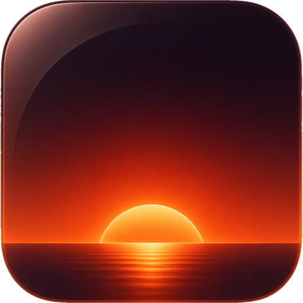

<p align="center">
  
</p>

<h1 align="center">Abendrot</h1>

<p align="center"><code>v0.1.0-beta.1</code></p>

<p align="center">
  <strong>A macOS app for your circadian rhythm.</strong><br>
  Your Mac's screen warms with the evening — on <em>every</em> display — so your nights stay calm and your mornings stay sharp.<br>
  Free, open-source, and grounded in peer-reviewed light research. Read every line of it.
</p>

<p align="center">
  <a href="LICENSE"></a>
  
  
  
  <a href="https://github.com/matthewrball/abendrot/stargazers"></a>
</p>

<p align="center">
  <sub>Built in the open · <a href="https://abendrot.app">abendrot.app</a> · Signed builds + <code>brew install --cask abendrot</code> land with v1.0</sub>
</p>

---

**Abendrot** (German: *the red glow of sunset*) warms your screen's color temperature across **every** display — built-in *and* external — to support your circadian rhythm in the evening. It has an instant **Reveal True Color** hotkey for color-critical work, a Liquid Glass interface, and zero telemetry by default.

It's the f.lux / Night Shift successor built to do the thing the incumbents quietly fail at: reliably warm **external monitors** and the **buttonless Apple displays** — Studio Display, Pro Display XDR, LG UltraFine — and keep working on the newest Apple Silicon Macs, where the classic gamma trick silently stops warming. Without tracking you.

> **Status: pre-release.** The warmth engine is implemented and unit-tested (112 tests) and verified warming real hardware. There's no signed download yet — you can build it from source today (see [Build from source](#build-from-source)). The first notarized release lands here when it's ready.

## Grounded in the science

Your eye has a non-visual light sensor — melanopsin, in a class of retinal cells called ipRGCs — that is most sensitive to short-wavelength **blue light around 480–490 nm** and helps tell your brain whether it's day or night ([Berson et al., 2002](https://doi.org/10.1126/science.1067262); [CIE S 026:2018](https://doi.org/10.25039/S026.2018)). Warmer, dimmer light in the evening puts less energy in that band.

Abendrot is designed around that: it attenuates the display's blue channel as it warms, and at its warmest everyday setting (~1900 K) the warming curve **takes the blue channel to zero**. We **link the research rather than asserting health outcomes** — and because the dose depends on intensity as much as color, the honest advice is to **also lower your screen brightness** in the evening. See [The science](#the-science) for citations.

> General wellness, not medical advice. Abendrot reduces evening blue-light exposure; it is not a medical device and makes no claim to treat or improve any condition.

## Why Abendrot

- **Warmth that actually lands on every display.** A layered engine warms each display with the best true-warming method available — and **tells you which one each display is using**, never a silent no-op.
- **Reveal True Color.** Hold a global hotkey and warmth lifts across every display for color-critical work; release and it eases back. Built for designers and photographers.
- **Scriptable & AI-controllable.** An `abendrot` CLI drives the running app from your terminal — or from an AI assistant like Claude Code, Codex, or Cursor. Read live state as JSON, set warmth, trigger a reveal. *(see [Scripting & AI control](#scripting--ai-control))*
- **Health is the reason; reliability is the proof.** Abendrot helps you keep warmer, lower-blue light in the evening, and links the circadian research instead of making medical claims.
- **Genuinely trustworthy.** MIT-licensed, no telemetry by default, no account, runs entirely on your Mac. The anti-NightOwl.

## How it works

Warmth is applied per display by a layered engine that picks the best working method and reports it in the UI:

| Layer | What it is | Role |
|---|---|---|
| **Gamma** | The system display transfer table (`CGSetDisplayTransferByTable`) | **The universal true-warm default** — works OS-level on built-in *and* external displays, including buttonless Apple displays. Chip/OS-aware: used where it genuinely warms, never where it would silently no-op. |
| **Hardware (DDC)** | Real panel RGB-gain over DDC/CI | Opt-in per display — a hardware upgrade where a monitor exposes gain control. |
| **Overlay** | A per-screen Metal veil | The universal floor — works on every display type, always available as a fallback. |

Each connected display shows a small badge — `Gamma` / `Hardware` / `Overlay` — so you always know what's actually happening. The schedule follows your system Night Shift window when available, or a custom/manual schedule.

## Scripting & AI control

Abendrot ships a command-line tool, `abendrot`, that drives the **running app** — so you can script screen warmth from a shell, a keybinding, a `launchd`/`cron` job, or hand the same commands to an AI coding assistant like **Claude Code, Codex, or Cursor**. It's the same auditable engine the menu bar drives, now with a command surface you can read and automate.

```sh
abendrot set warmth 0.8        # warm the screen to 80%
abendrot status --json         # read live state as JSON — pipe it anywhere
abendrot reveal --hold 10      # momentary true-color peek, then ease back
```

**Trust boundary, stated honestly:** `abendrot` talks to the app as the **same macOS user, in your local session**, and changes **visual state only** — no network listener, no privileged helper. An AI assistant "controlling Abendrot" is just running the same `abendrot` command you could type yourself, and it can't reach any further than you can. When you install the app, the binary ships inside the bundle and the Homebrew cask symlinks it onto your `PATH`.

<details>
<summary><strong>Common tasks → commands</strong> — the v1 surface (<code>abendrot --help</code> for everything)</summary>

| Task | Command |
|---|---|
| Set warmth (0–1, or by Kelvin) | `abendrot set warmth 0.8` · `abendrot set warmth --kelvin 2700` |
| Read live status as JSON | `abendrot status --json` |
| Read one configured setting | `abendrot get warmth` |
| Turn warming on / off | `abendrot on` · `abendrot off` |
| Set the schedule mode | `abendrot set mode sunset` *(or `always-on` / `off`)* |
| Set the warmest point the slider maps to | `abendrot set max-warmth 1900` |
| Toggle cozy mode (the deepest candle/ember warmth) | `abendrot cozy on` · `abendrot cozy off` |
| Choose hold vs toggle for reveal | `abendrot set reveal-mode hold` *(or `toggle`)* |
| Set location for the sunset schedule | `abendrot set location --auto` *(or `<lat> <lon>`)* |
| Exclude an app from warming | `abendrot exclude add com.apple.FinalCut` |
| List / remove exclusions | `abendrot exclude list` · `abendrot exclude remove <bundle-id>` |
| Momentary true-color reveal | `abendrot reveal --hold 8` |

Machine-readable everywhere: every command takes `--json`, and exit codes are scriptable (`0` ok · `2` bad input · `3` app not running · `4` live-apply timeout). See [`AGENTS.md`](AGENTS.md) for the full agent-facing reference.

</details>

## How it compares

| | **Abendrot** | Apple Night Shift | f.lux | Redshift |
|---|---|---|---|---|
| Platform | macOS 26+ | macOS / iOS | macOS / Windows / Linux | Linux / X11 |
| Warmest setting | **~1900 K** — the warming curve takes the blue channel to its practical minimum | ~2700–3400 K <sup>1</sup> (Apple publishes no value); never reaches ~1900 K | ~1900 K ("Candle") | Configurable |
| Blue at the warmest setting | Driven to its practical zero | Reduced, but not eliminated <sup>2</sup> | Deep (candle) | Depends on setting |
| Warms Apple's buttonless displays (Studio Display, Pro Display XDR) | Yes | Yes (Apple's own) | No | No |
| Reliable on third-party external monitors | Yes (layered, with fallback) | Inconsistent <sup>1</sup> | Gamma only; unreliable | X11 only |
| Shows the actual color temperature + method, per display | Yes | No — a "Less / More Warm" slider | No | Per-output |
| Reveal-true-color hotkey | Yes (hold) | No | No | Toggle only |
| Scriptable CLI / AI control | Yes (`abendrot`, `--json`) | No | No | Partial (CLI) |
| Open source | Yes (MIT) | No | No (freeware, closed) | Yes (GPL) |
| Telemetry | None by default | Apple's | Unknown (closed-source) | None |
| Price | Free forever | Free (built in) | Free | Free |

<sub>Night Shift is a fine, free, built-in option — especially on a MacBook's own display. Abendrot is for deeper warmth and reliable warming across **every** external display, with the actual Kelvin and warming method shown per screen.</sub>

<sub><sup>1</sup> Apple publishes no Kelvin value for Night Shift; ~2700–3400 K is a third-party estimate (Iris, f.lux). On external displays, Apple states performance "depends on the characteristics of the display" ([Apple Support](https://support.apple.com/en-us/102191)). <sup>2</sup> Per Michael Herf of f.lux (2017 spectrometer measurement, macOS 10.12.4), Night Shift removes under ~30% of blue light's biological impact at its default setting. Figures reflect third-party measurements/estimates and our own testing. General wellness, not medical advice.</sub>

## Install

> **Pre-release.** Abendrot isn't downloadable yet. Signed, notarized builds and a Homebrew cask arrive with **v1.0** — watch [Releases](https://github.com/matthewrball/abendrot/releases) or [abendrot.app](https://abendrot.app). Until then, build from source below.

*Coming with v1.0:* download a `.dmg` from Releases, or `brew install --cask abendrot` (which also puts the `abendrot` CLI on your `PATH`). Requirements: macOS 26 "Tahoe" or later, Apple Silicon.

## The science

Abendrot makes no health claims of its own — it links the research and lets you read it. A few starting points, all peer-reviewed:

- The human melatonin-suppression action spectrum peaks in the blue (~459–464 nm) — [Brainard et al., 2001, *J Neurosci*](https://doi.org/10.1523/JNEUROSCI.21-16-06405.2001); [Thapan et al., 2001, *J Physiol*](https://doi.org/10.1111/j.1469-7793.2001.t01-1-00261.x).
- It's the melanopic (short-wavelength) content of evening screen light that drives the effect — more than overall brightness — [Schoellhorn et al., 2023, *Communications Biology*](https://doi.org/10.1038/s42003-023-04598-4).
- An expert consensus on supportive evening/night light targets (measured in melanopic terms, not Kelvin) — [Brown et al., 2022, *PLoS Biology*](https://doi.org/10.1371/journal.pbio.3001571).
- Melatonin suppression is also driven by **light intensity**, with much of the effect at modest indoor levels — so dimming matters too — [Zeitzer et al., 2000, *J Physiol*](https://doi.org/10.1111/j.1469-7793.2000.00695.x).
- Individual sensitivity to evening light varies more than **50-fold**, so there's no single "correct" setting — [Phillips et al., 2019, *PNAS*](https://doi.org/10.1073/pnas.1901824116).
- On eye strain: ophthalmologists find no good evidence that screen blue light damages your eyes — blinking, breaks, and the 20‑20‑20 habit help — [American Academy of Ophthalmology, 2024](https://www.aao.org/eye-health/tips-prevention/should-you-be-worried-about-blue-light).

> Individual responses to light vary widely; these are general-wellness references, not a promise of any outcome. Pair warmth with lower brightness for the biggest reduction in evening light exposure.

## Build from source

Requires **macOS 26 "Tahoe"**, **Xcode 26**, and [XcodeGen](https://github.com/yonaskolb/XcodeGen) (`brew install xcodegen`).

```sh
git clone https://github.com/matthewrball/abendrot.git
cd abendrot

# Engine package — builds and tests headlessly, no app bundle needed
swift test --package-path WarmthKit          # 112 tests / 22 suites

# The app
xcodegen generate                            # generates Abendrot.xcodeproj from project.yml
open Abendrot.xcodeproj                       # build & run the Abendrot scheme in Xcode

# The CLI (optional) — a standalone thin client to the running app
swift build -c release --package-path cli
./cli/.build/release/abendrot --version      # → 0.1.0
```

It runs in the menu bar — look for the sunset arc. Quit from the popover footer (power icon) or ⌘Q.

## Tech

Native **Swift 6** (SwiftUI + AppKit), **macOS 26 "Tahoe"**, Apple Silicon. No Electron, no bundled runtime. The warmth engine lives in a standalone, unit-tested Swift package (`WarmthKit`); the app is a small menu-bar agent; the `abendrot` CLI is a separate thin client that talks to the running app.

## Privacy

No telemetry by default. No account, no identifiers, nothing leaves your Mac unless you explicitly opt in to anonymous, aggregate usage stats later. See [`PRIVACY.md`](PRIVACY.md).

## Contributing

Issues and pull requests are welcome — bug reports from real display setups are especially valuable, since the whole point is reliability on hardware we can't all test on. See [`CONTRIBUTING.md`](CONTRIBUTING.md). Security disclosures: [`SECURITY.md`](SECURITY.md).

## License

[MIT](LICENSE) © Matthew Ball. Free forever — never behind a paywall. If Abendrot helps your evenings, you can support its maintenance via GitHub Sponsors.

---

<p align="center"><sub>Soften into the evening.</sub></p>
