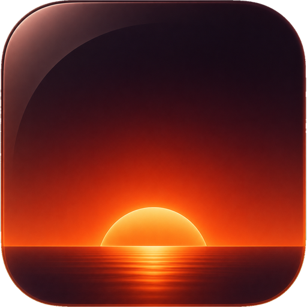

<p align="center">
  
</p>

<h1 align="center">Abendrot</h1>

<p align="center">
  <strong>The macOS app for your circadian rhythm</strong><br>
  <br>
  Grounded in <a href="https://abendrot.app/#science">peer-reviewed light research</a>, Abendrot warms your displays around your local sunset.<br>
  <strong>Free and open source. No ads, no in-app purchases, no paywall.</strong>
</p>

<p align="center">
  <a href="LICENSE"></a>
  
  
  <a href="https://github.com/matthewrball/abendrot/releases/latest"></a>
  <a href="https://github.com/matthewrball/abendrot/stargazers"></a>
</p>

<p align="center">
  <sub>Built in the open · <a href="https://abendrot.app">abendrot.app</a> · MIT licensed</sub>
</p>

<p align="center">
  <a href="https://abendrot.app">
    
  </a>
</p>

---

**Abendrot** is a native macOS menu-bar app that warms each display using the methods available on that Mac. When direct display warming is unavailable, it can fall back to a screen tint.

## Install

Download the signed, notarized `.dmg` from [abendrot.app/download](https://abendrot.app/download/), or from [GitHub Releases](https://github.com/matthewrball/abendrot/releases/latest).

Requires macOS 14 "Sonoma" or later. Universal for Apple silicon and Intel.

### Homebrew

```sh
brew install --cask matthewrball/tap/abendrot
```

The cask installs the same signed, notarized release and adds the bundled
`abendrot` command-line tool to your `PATH`.

> Abendrot is free and open source under the MIT License. If it is useful to you, please [star the repository](https://github.com/matthewrball/abendrot/stargazers).

## Why Abendrot

- **Per-display warming.** Abendrot detects the methods available to each display and uses direct warming or a screen tint where supported.
- **Reveal True Color.** Hold a global hotkey to temporarily lift warmth; release it to restore warmth.
- **Scriptable & AI-controllable.** An `abendrot` CLI drives the running app from your terminal — or from an AI assistant like Claude Code, Codex, or Cursor. Read live state as JSON, set warmth, trigger a reveal. *(see [Scripting & AI control](#scripting--ai-control))*
- **Health is the context; reliability is the proof.** Abendrot gives you warmer, lower-blue light in the evening, and links the circadian research instead of making medical claims.
- **Local and auditable.** MIT-licensed, no telemetry, no account. Settings and usage statistics stay on your Mac; only update checks contact GitHub.

## WarmthKit

**Warmth that adapts to every display.** [`WarmthKit`](WarmthKit) is Abendrot's
open-source display engine. It keeps built-in and external screens warm through
sleep, wake, and reconnects, and falls back to a screen tint instead of silently
doing nothing when direct warming is unavailable.

## Scripting & AI control

Abendrot ships a command-line tool, `abendrot`, that drives the **running app** — so you can script screen warmth from a shell, a keybinding, a `launchd`/`cron` job, or hand the same commands to an AI coding assistant like **Claude Code, Codex, or Cursor**. It's the same auditable engine the menu bar drives, now with a command surface you can read and automate.

```sh
abendrot set warmth 0.8        # warm the screen to 80%
abendrot status --json         # read live state as JSON — pipe it anywhere
abendrot reveal --hold 10      # momentary true-color peek, then ease back
```

**Trust boundary, stated honestly:** `abendrot` talks to the app as the **same macOS user, in your local session**, and changes **visual state only** — no network listener, no privileged helper. An AI assistant "controlling Abendrot" is just running the same `abendrot` command you could type yourself, and it can't reach any further than you can. The binary ships inside the app bundle; the Homebrew cask symlinks it onto your `PATH`.

Every command supports `--json`, with scriptable exit codes. See [`AGENTS.md`](AGENTS.md) for the complete CLI and agent-control reference.

## Research and comparisons

- [Research and supporting references](https://abendrot.app/#science)
- [How Abendrot compares with Night Shift and f.lux](https://abendrot.app/#vs)

> General wellness, not medical advice. Abendrot reduces evening blue-light exposure; it is not a medical device and makes no claim to treat or improve any condition.

## Tech

Native **Swift 6** (SwiftUI + AppKit), **macOS 14 "Sonoma" or later**, distributed as a
universal Apple silicon + Intel app. Tahoe uses native Liquid Glass; Sonoma and Sequoia
use the built-in material fallback. No Electron, no bundled runtime. The warmth
engine lives in a standalone, unit-tested Swift package (`WarmthKit`); the app
is a small menu-bar agent; the `abendrot` CLI is a separate thin client that
talks to the running app.

## Privacy

No telemetry. No analytics SDK, account, or identifiers. Settings and usage statistics stay on your Mac; only update checks contact GitHub. See [`PRIVACY.md`](PRIVACY.md).

## Contributing

Issues and pull requests are welcome — bug reports from real display setups are especially valuable, since the whole point is reliability on hardware we can't all test on. See [`CONTRIBUTING.md`](CONTRIBUTING.md) for the local build and test setup. Security disclosures: [`SECURITY.md`](SECURITY.md).

## License

[MIT](LICENSE) © Matthew Ball. Free and open source.

---

<p align="center"><sub>Warm into the evening.</sub></p>
